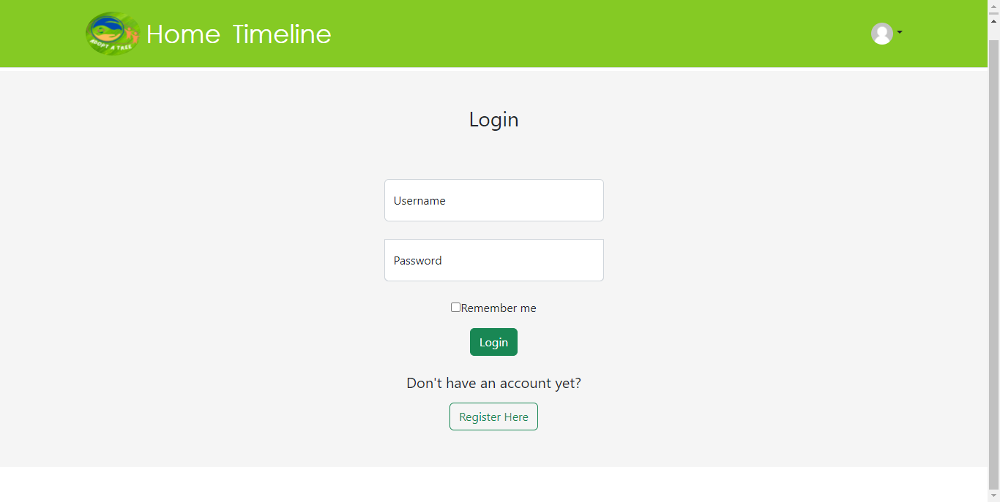
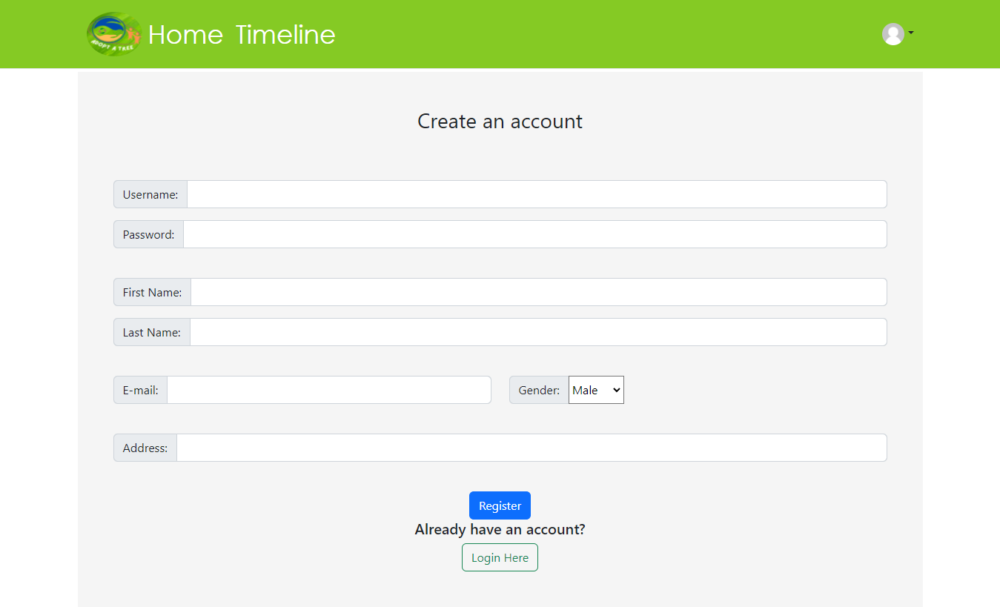
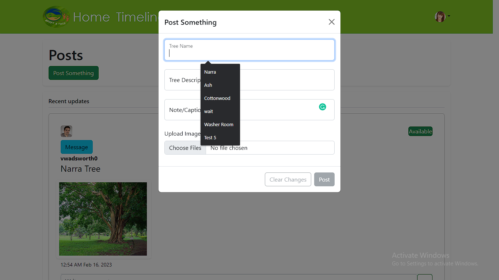
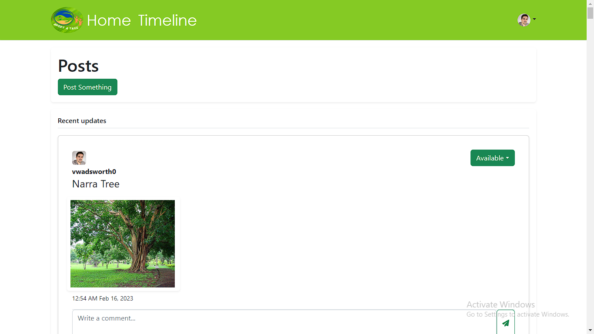
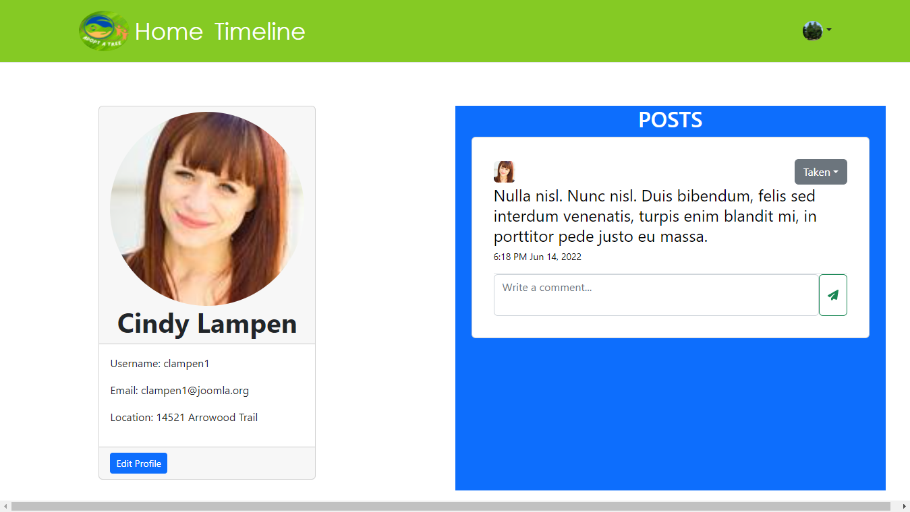
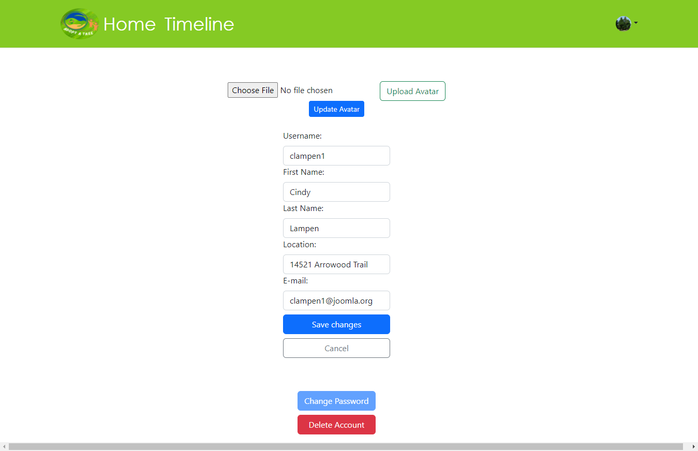
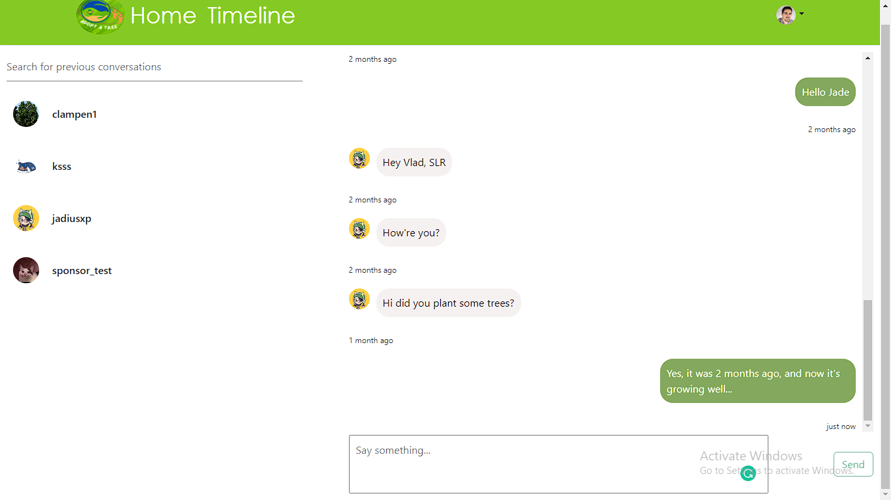

# Adopt-A-Tree

## Description

Welcome to the Adopt-A-Tree project, a community social-media app designed to connect people who are passionate about the environment, specifically trees. The app provides a platform for people to discuss their concerns, exchange ideas, share pictures and post about events related to trees and the environment. The project also aims to promote awareness about environmental issues and climate change while encouraging people to participate in tree planting initiatives. It also provides an avenue for users who may not have the time or knowledge to plant trees to connect with others who can help plant for them.

### Features

1. Login/Registration system for users.
2. A timeline page where users can post, comment, see recent posts, pictures, and comments, and upload pictures. The owner of the post could set the availability of the tree.
3. Messenger in where users can communicate with each other real-time.
4. Profile Page where user's info and profile picture is displayed in detail.

### Technologies Used
#### Languages:
* HTML
* CSS
* JavaScript

#### Frameworks:
- Bootstrap 5
- ExpressJS
- NodeJS
- REST API

#### Libraries:
- React
- Bcrypt
- Dotenv
- Multer

(See package.json for more libraries used)

#### Database Management System: 
- PostgreSQL

### Installation Instructions

1. Clone the Repository
2. Open in Visual Studio
3. Install the dependencies for the server:
    - Open Terminal and navigate to the server directory.
    - Type `npm init` and press enter until completed.
    - Type `npm install` to install the dependencies.
4. Create a local Database
    - Open SQL shell.
    - Login to your database.
    - Open the 'database.sql' file.
    - Copy and paste 'CREATE DATABASE capstone;' into the command line of SQL shell. (note: you can change "capstone" to anything you want)
    - After creating the database, type \c capstone (or your custom name of the database) into the command line.
    - Individually copy all the CREATE TABLE statements from the 'database.sql' file into the command line to create your tables.

5. Conneting the Database and the Server
    - Create a 'db.js' file
    - Copy and paste the following into your 'db.js' file:
    ```js
    import  pg  from  "pg"
    function  connectDatabase(){
        const  pool = new  pg.Pool ({
            user: '(your postgres username)',
            password: '(your postgres password)',
            host: 'localhost',
            port: 5432,
            database: 'capstone',
        })
            return  pool
        }
    ```

6. Create `.env` variable
    -Create a new file called '.env'.
    -Inside the '.env' file, input `JWT_SECRET = (insert your password-like string here)`.

7. Install the dependencies for the client:
    - Open a new terminal.
    - Navigate to the client directory.
    - Type `npm install` to install the dependencies.

8. Turn on the project:
    - Open a new terminal.
    - Navigate to the server directory.
    - Type `npm start`.
    - Open a new terminal.
    - Navigate to the client directory.
    - Type `npm start`.

## Design

### Home Page
The home page welcomes the user to the Adopt-A-Tree application. It has a call-to-action button that invites the user to register for an account. It also features a hero section with a background image of trees, and a slogan that promotes the app's purpose.


### Login Page
The login page has a form that allows the user to log in to their account. It has fields for email and password, as well as a "Remember me" checkbox. It also has a link that redirects the user to the registration page.



### Registration Page
The registration page has a form that allows the user to create a new account. It has fields for name, email, password. It also has and a link that redirects the user to the login page.



### Timeline Page
The timeline page is where users can see recent posts from other users. It has a post section where users can create new posts. Each post has a title, body, and an image upload button. 




### Profile Page
The profile page displays and could edit the user's information, including their name, email, and profile picture. It also has a "Change Password" button that redirects the user to the password change page. There's also a "Delete Account" button that deletes the user's account. The user can also see a list of all the posts they've made on the right section.




### Messenger
The messenger is where users can communicate with each other in real-time. It has a chat section where users can send and receive messages. The user can also see a list of all the conversations they've had on the left section.



Please feel free to reach out to me if you face any issues or have any questions about the project. We hope you enjoy using Adopt-A-Tree and contributing to a better environment!